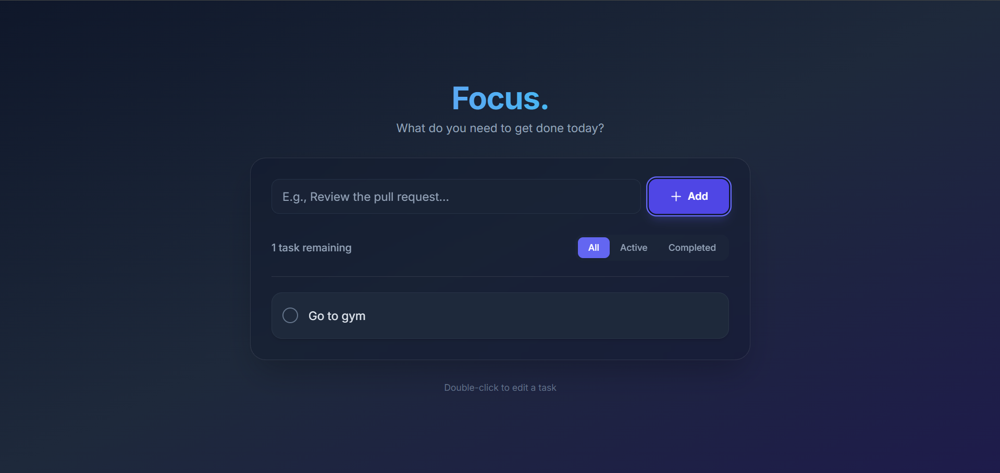

# Focus - Modern Todo App



Focus, günlük görevlerinizi şık, minimal ve odaklanmanızı kolaylaştıracak bir arayüzle yönetmenizi sağlayan modern bir Todo uygulamasıdır. React, TypeScript, Vite ve Tailwind CSS kullanılarak inşa edilmiştir.

## Özellikler
- **Görev Ekleme**: Yeni görevlerinizi kolayca ekleyin.
- **Listeleme**: Görevlerinizi aktif ve tamamlanmış olarak filtreleyin.
- **Güncelleme**: Görev üzerine çift tıklayarak hızlıca düzenleyin.
- **Silme**: Tek tıklama ile tamamlanmış veya vazgeçilmiş görevleri kaldırın.
- **Yerel Depolama (LocalStorage)**: Sayfayı yenilediğinizde dahi görevleriniz kalıcıdır.
- **Responsive Tasarım**: Bilgisayar, tablet veya mobilde mükemmel görünüm.
- **Dark Mode**: Göz yormayan, estetik `glassmorphism` tasarım ögeleri.

## Teknolojiler
- **React (v18+)**
- **TypeScript**
- **Vite**
- **Tailwind CSS**

## Kurulum ve Çalıştırma

Projeyi lokal bilgisayarınızda çalıştırmak için aşağıdaki adımları izleyin:

1. Gereksinimler: Bilgisayarınızda [Node.js](https://nodejs.org/) kurulu olmalıdır.
2. Proje dizinine terminalden gidin:
   ```bash
   cd todo-app
   ```
3. Gerekli paketleri indirin:
   ```bash
   npm install
   ```
4. Geliştirme sunucusunu başlatın:
   ```bash
   npm run dev
   ```
5. Terminalde size verilen adresi (`http://localhost:5173` vb.) tarayıcınızda açın.

## Netlify ile Deploy (Yayınlama)

Projeyi internet üzerinde canlıya almak (host etmek) isterseniz Netlify en kolay çözümlerden biridir.

### Seçenek 1: Sürükle Bırak (Github'sız)
1. Terminalde `npm run build` komutunu çalıştırın.
2. Bu işlem sonucunda `dist` isminde bir klasör oluşur.
3. [Netlify.com](https://app.netlify.com/drop) sitesine girin.
4. Oluşan `dist` klasörünü ekrandaki dairenin içerisine sürükleyip bırakın. Siteniz 1 dakika içinde yayında olacaktır!

### Seçenek 2: Github Üzerinden Eşitleme
1. Projenizi bir Github reposuna aktarın (push işlemi).
2. Netlify panelinden "Add new site" > "Import an existing project" adımlarını takip edin.
3. Github'ı seçin ve repoyu yetkilendirin.
4. Ayarlardan:
   - **Build command**: `npm run build`
   - **Publish directory**: `dist`
5. "Deploy site" butonuna tıklayarak otomatik kurulumu tamamlayın.

---
*Bu proje modern web standartları benimsenerek hazırlanmıştır.*
